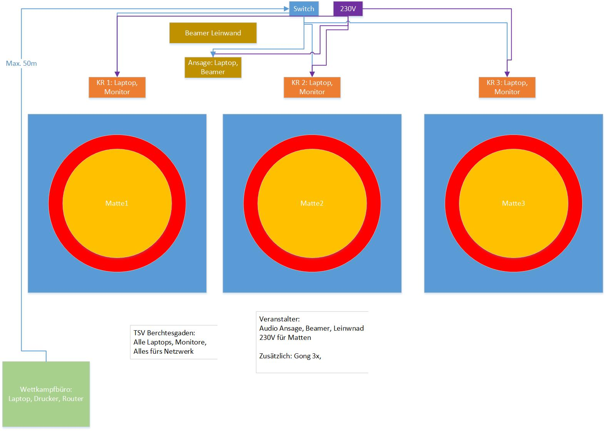
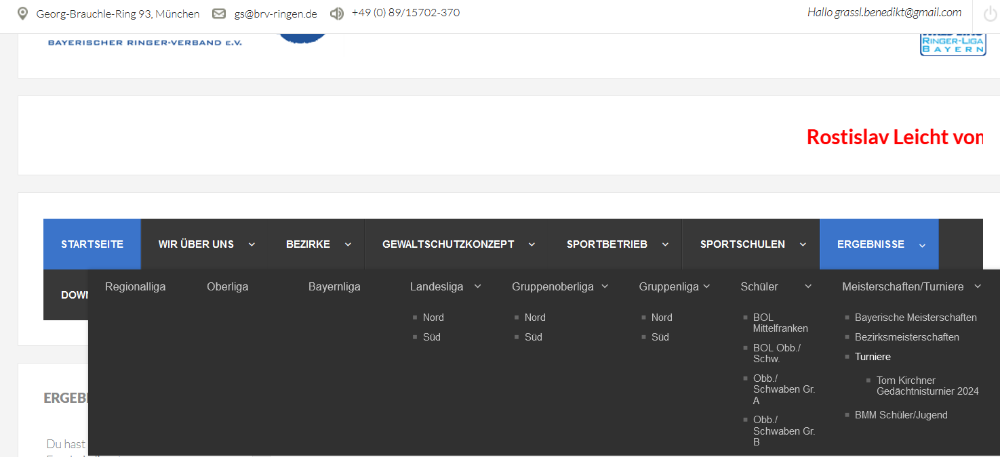
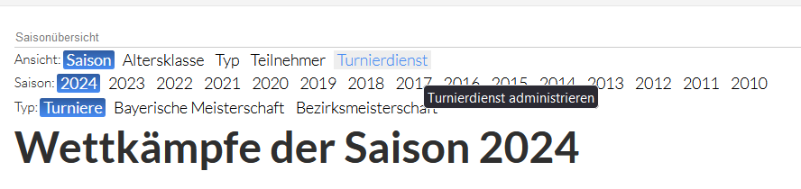
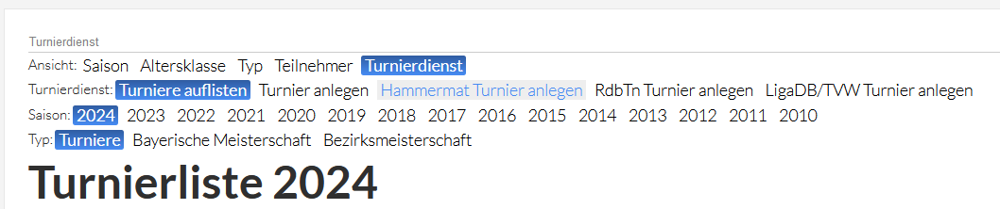
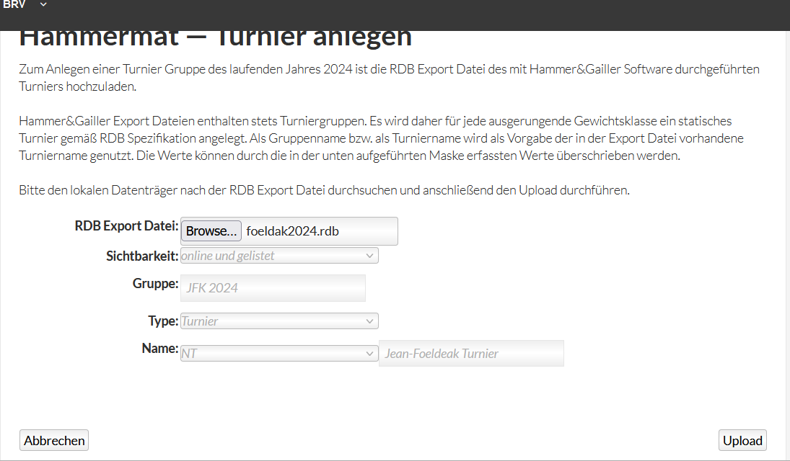
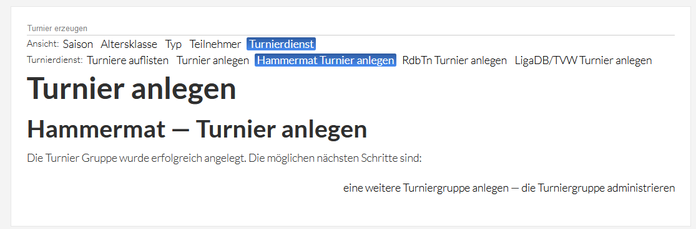

# Chiemgau Meisterschaft
Diese Liste enthält Todos für ein Ringer-Turnier mit der Hammer-Turnierauswertung.

## Mattenaufbau

## Vorbereitung

### Hardware
- [ ] 1 langes Netzwerkkabel (> 40m)
- [ ] andere Netzwerkkabel (3 * 10m, 1 * 5m)
- [ ] 1 Switch (mind. 5 Ports)
- [ ] DHCP-Server (Fritzbox, mind. 3 LAN-Ports)
- [ ] 1 Laserdrucker zum Drucken der Wettkampflisten
- [ ] 1 Tintenstrahldrucker zum Drucken der Urkunden mit dem dicken Papier
- [ ] Papier (2 verschiedene Farben für Starterkarten pro Stilart)
- [ ] Schneidemaschine zum Zuschneiden von Starterkarten
- [ ] 2 Ordner mit Registern für Wettkampfliste im Büro (pro Stilart einen, optional)
- [ ] Ordner anlegen mit: Anleitung Programm, Ausschreibung, Regeln
- [ ] Briefumschläge zum Bündeln von Startkarten (Namen des Vereins draufschreiben)
- [ ] 2 Scheren
- [ ] Locher
- [ ] Klebeband und Tesa
- [ ] Klarsichtfolien + Inhalt für "Matte X" und "Jugend X" zum Aushang der Wettkampflisten
- [ ] Notebooks mit Turnierprogramm: 2 * Wettkampfbüro (brauchen Freischaltung), 3 für 3 Kampfrichtertische (Freischaltung optional), 1 für Ansager (Freischaltungen optional)
- [ ] Schuhschachteln o.ä. zum Sammeln der Urkunden + Medallien pro Altersklasse und Stilart
- [ ] Blanko-Startkarten ausdrucken für Nachmeldung

### Software
- [ ] 2 Turniere (FS + GR) anlegen, zuerst das FS-Turnier aktivieren
- [ ] Excel-Listen mit gemeldeten Teilnehmern (Prüfen ob Import funktioniert, Probeturnier anlegen)
- [ ] Prüfung: Anzahl Startkarten im Ordner muss gleich der Anzahl im Programm sein
- [ ] Probedruck Urkunden (inkl. Einstellung der Vorlage im Programm), Vorlagen können direkt im Access (unten rechts) bearbeitet werden. Vordruck Chiemgau: UrkundenPenzbergBM2009_AC

### Kampfrichtertische
Pro Tisch brauchen wir:
- [ ] 1 Laptop mit Access und Turnierauswertung (Freischaltung optional)
- [ ] Bildschirm für die Anzeige
- [ ] Ladekabel, Maus, Netzwerkanschluss
- [ ] Gong und Punktetafel (als Backup)
- [ ] Stift
- [ ] Programm freigeschalten?
- [ ] IP-Adresse vom DHCP-Server bezogen?
- [ ] Zugriff auf freigegebenen Ordner/Turnier am Hauptrechner funktioniert?
- [ ] Turnier auf Hauptrechner verbinden
- [ ] Mattennummer im Programm unter "Drucker/Optionen" eingetragen
- [ ] kurze Schulung für die Bediener
- [ ] Liste zum Mitschreiben "Ergebnisliste für Kampfrichtertisch", Link zum [Download auf der BRV-Website](https://www.brv-ringen.de/index.php?option=com_wbw&view=wbw&Itemid=516&tk=dw&dwbid=1&op=lcl&opa=0&ops=counter&dwcid=21#top)

### Ansager
- [ ] ein Laptop für die Beameranzeige, idealerweise mit Dock mit zwei HDMI-Anschlüssen
- [ ] idealerweise ein Beamer und ein Fernseher zur Anzeige der Kampffolge auf beiden Seiten der Halle (Zuschauer -> Beamer, Kampfrichtertisch -> Fernseher)
- [ ] kurze Schulung für den/die Ansager

### Wettkampfbüro
- [ ] Turniere anlegen
- [ ] bekannte Starter importieren
- [ ] Starterkarten ausdrucken, zuschneiden, bündeln (pro Verein) - zwei versch. Farben für FS + GR
- [ ] erstes Turnier (FS) aktiv schalten
- [ ] Wiegen: zwei Notebooks für die schnellere Eingabe beim Wiegen
- [ ] wenn FS fertig: GR-Turnier aktiv schalten und Ringer in Klassen eintteilen

## Durchführung

### Generell
- [ ] nach jedem Schritt (vor dem Turnier, nach der Waage, usw.) im Programm prüfen, ob alles passt!
- [ ] Wettkampffolge festlegen: die Klasse mit den meisten Teilnehmern zuerst, auf ausreichend Abstand zwischen zwei Runden achten am Schluss!
- [ ] Wettkampffolge für Ansager und Büro ausdrucken, fertige Runde mit Stift durchstreichen
- [ ] List mit Anzahl Urkunden & Medallien pro Klasse
- [ ] Urkunden immer sofort drucken
- [ ] Wettkampflisten 2*drucken: einmal aushängen, einmal in Ordner einheften
- [ ] wenn Klasse fertig: alle Urkunden drucken, Medallien
- [ ] Sollten die Teilnehmerzahlen um ein oder mehrere Ringer nicht, passen, ist wahrscheinlich ein Ringer-DB-Eintrag verwaist. Diese kann ich über ein Query finden und löschen: 

### Wechsel auf Griechisch-Turnier
- [ ] Durchsage Ringer streichen, die aus dem Turnier fallen
- [ ] FS-Turnier am Hauptrechner deaktiveren, Greco-Turnier aktivieren
- [ ] abgemeldete Ringer aus Turnier entfernen

### Todo
- [ ] Starterkarten wiederholt beim Wiegen einsammeln und eingeben
- [ ] E-Jugend Klassen einteilen
- [ ] Wiegelisten ausdrucken und aufängen
- [ ] Meldung an Betreuer, dass Klasseneinteilung stimmt *bevor* das Turnier gestaret wird
- [ ] Wettkampffolge festlegen
- [ ] Ausdruck für Ansager
- [ ] Nach jeder Runde: Poolzettel ausdrucken und Aufhängen
- [ ] Sobald eine Gewichtsklasse fertig ist: Urkunden ausdrucken
- [ ] alle Teilnehmer, die auch in Greco starten gleich mit eintragen!

## Upload auf BRV-Seite

Zunächst auf der BRV-Seite zu den Turnieren navigieren:

Hier erscheint der Link zum *Turnierdienst* oben rechts:

Als nächstes ein *Hammermat-Turnier* anlegen:

Hier die *RDB*-Datei hochladen. Diese wird automatisch im Sicherungspfad des Programms abgelegt, wenn man sichert.
Die Gruppe entsprechend auswählen, hier im Beispiel fürs Jean-Foeldeak-Turnier 2024.
Eine Gruppe hat den Vorteil, dass auch gestückelte Turniere (mehrere MBD-Dateien) zusammen gelistet werden.
Wenn man gleich *online und gelistet* einstellt, taucht das Turnier sofort auf.

Sollte etwas verändert werden müssen, kann man das Turnier nachträglich administrieren:

